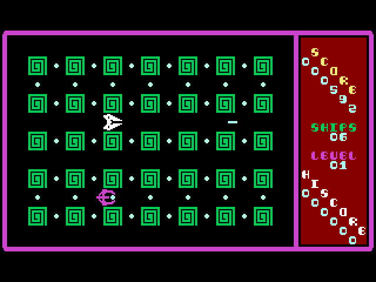

# Damon: The Rocket Jockey

**Damon: The Rocket Jockey** is a [Commander X16](https://www.commanderx16.com/)
clone of the Commodore 64 game
[Nomad: The Space Pirate](https://gb64.com/game.php?id=20100). It was written
from scratch in 65C02 assembly, and is released under the MIT license. It has
been tested with ROM version 47 using the Commander X16 Emulator, and with ROM
version 46 on real hardware.

## Screenshot



## Gameplay

The goal of the game is to pick up all of the pellets on each level while
avoiding the enemy ship(s). Once all pellets have been collected on a level,
shoot any remaining enemies to advance to the next level.

A bonus ship is awarded every 10,000 points.

## Controls

The game accepts input from any of the controllers attached to the system,
including the
[keyboard joystick](https://cx16forum.com/forum/viewtopic.php?t=6327). The
D-pad or arrow keys steer your ship, and any other controller button fires
your gun.

## Building

This game was written using [ca65](https://cc65.github.io/doc/ca65.html)
assembly syntax. To build it, you will need the following build dependencies
to be installed:

* [cc65](https://cc65.github.io/) (really just `ca65` and `ld65` are required)
* [Python 3](https://www.python.org/) (for generating dependency files)
* [GNU Make](https://www.gnu.org/software/make/)

Once these are installed (and vailable on your shell's search path), you can
build the game by navigating to the repository root and issuing the command:

```
make
```

This will produce the game binary in a file named `damon.prg`.

If you have the
[Commander X16 Emulator](https://github.com/X16Community/x16-emulator)
installed, you can also start the game with either of these commands:

```
make run
```

or

```
make debug
```

The latter command will start the game with the debugger enabled.
